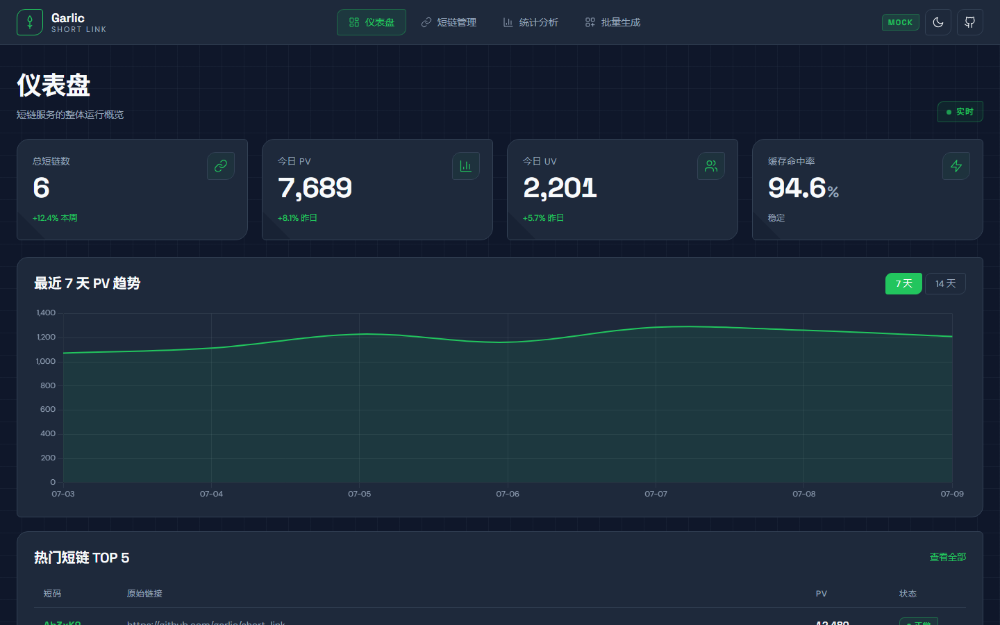
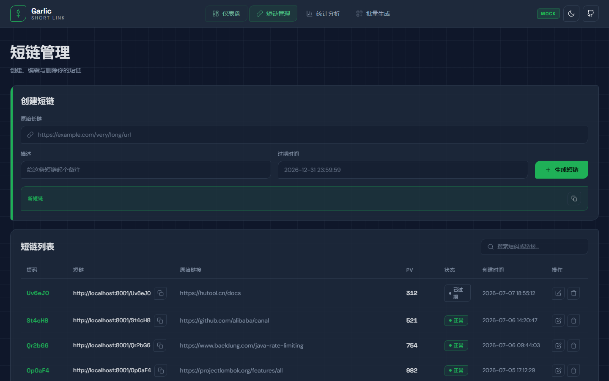
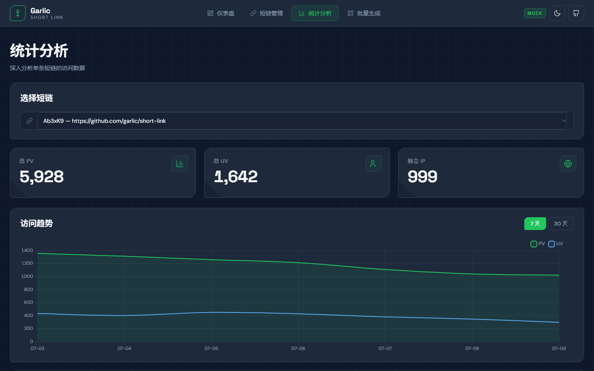
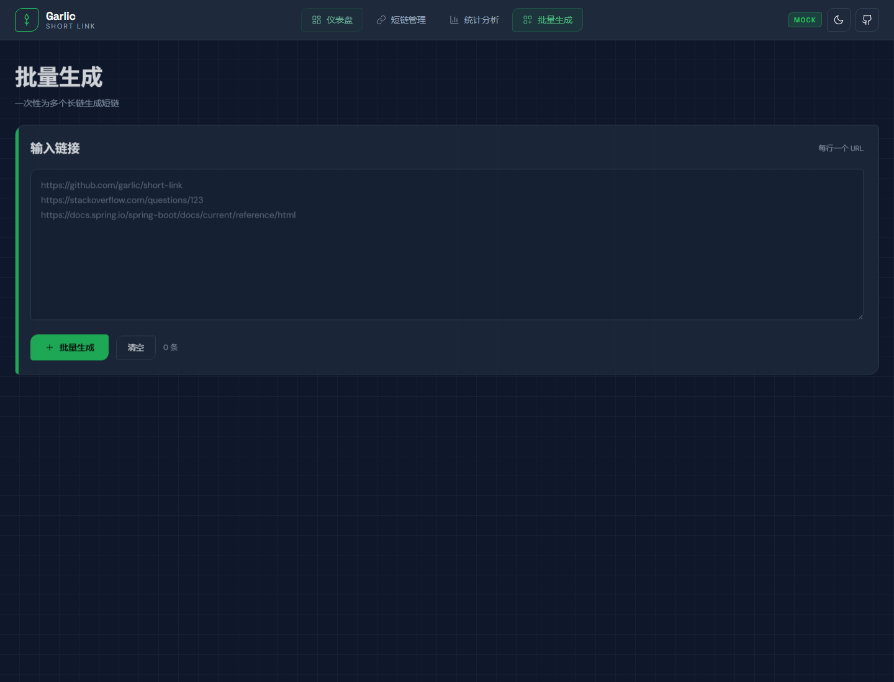

# Garlic 短链接服务

> 一个面向 Java 后端面试的高并发短链接服务项目，涵盖三级缓存、分库分表、多级限流熔断、Kafka 削峰与多线程异步聚合等核心后端能力。

## 项目亮点

1. **三级缓存架构 + 缓存一致性**：`Caffeine(L1 本地) → Redis(L2 分布式) → MySQL` 三级查询链路，配合热点 key 探测、延迟双删 + Kafka 广播保证多实例 L1 缓存一致性，布隆过滤器防穿透、分布式锁防击穿、TTL 随机抖动防雪崩。
2. **ShardingSphere 分库分表**：短链表按 `short_code` 哈希分 4 库 × 4 表 = 16 分片，访问明细表按 `access_time` 月份自动分表，访问统计表与短链表绑定同分片键，广播表 `t_user/t_group` 避免跨库 join，雪花算法 + Base62 生成 6~7 位短码。
3. **多级限流 + 熔断降级 + 幂等防刷**：接口级令牌桶（Redis + Lua）、用户级/IP 级滑动窗口（ZSet）三层限流，`@RateLimit` AOP 切面统一拦截；Sentinel 慢调用/异常比例熔断 + 本地缓存降级；Redis SETNX + Redisson 分布式锁保证创建接口幂等；IP 黑名单动态封禁恶意流量。
4. **Kafka 削峰 + 多线程异步聚合**：跳转请求 → 本地队列(10000) → Kafka → 消费者内存聚合(ConcurrentHashMap 两级) → 定时落库，UV 基于 Redis HyperLogLog 去重；4 个隔离线程池 + Micrometer 指标监控；G1 调优 2G 堆支撑单节点 5000 QPS。

## 技术栈

| 组件 | 版本 | 用途 |
|------|------|------|
| Spring Boot | 2.7.18 | 应用框架，提供自动装配、Web、定时任务等 |
| Java | 17 | 编程语言，使用 record、密封类等新特性 |
| MyBatis-Plus | 3.5.5 | ORM 框架，简化 CRUD 与分页 |
| Redis | 6+ | 分布式缓存、分布式锁、限流计数、HyperLogLog |
| Redisson | 3.20.1 | 分布式锁、布隆过滤器、Redis 客户端 |
| Caffeine | 3.1.8 | 本地高性能缓存（L1） |
| Kafka | 3.x | 访问记录异步上报、缓存失效广播 |
| ShardingSphere-JDBC | 5.2.1 | 分库分表中间件，INLINE/INTERVAL_RANGE 分片 |
| Sentinel | 1.8.6 | 熔断降级、限流，SPI 文件持久化规则 |
| Hutool | 5.8.22 | 工具集（JSON、加密、IO 等） |
| MySQL | 8.0 | 持久化存储，InnoDB + utf8mb4 |
| Lombok | 1.18.30 | 简化样板代码 |
| Micrometer + Prometheus | - | 线程池/GC/缓存指标监控 |

## 系统架构图

```
                              ┌─────────────────────────────────────────────┐
                              │              客户端 (浏览器 / App)            │
                              └────────────────────┬────────────────────────┘
                                                   │ HTTP
                                                   ▼
┌──────────────────────────────────────────────────────────────────────────────────┐
│                          Spring Boot 应用 (port 8001)                            │
│                                                                                  │
│  ┌──────────┐  ┌──────────────┐  ┌──────────────┐  ┌───────────┐  ┌──────────┐ │
│  │ 限流 AOP  │  │ Sentinel 熔断 │  │  Controller  │  │ IP 黑名单  │  │ 全局异常  │ │
│  │@RateLimit│  │  blockHandler │  │  (5 个 REST) │  │  动态封禁  │  │  处理器  │ │
│  └────┬─────┘  └──────┬───────┘  └──────┬───────┘  └─────┬─────┘  └──────────┘ │
│       │               │                 │                │                      │
│       ▼               ▼                 ▼                ▼                      │
│  ┌────────────────────────────────────────────────────────────────────────────┐ │
│  │                            Service 业务层                                   │ │
│  │  ┌──────────┐ ┌──────────┐ ┌──────────┐ ┌──────────┐ ┌──────────────────┐ │ │
│  │  │ Create   │ │  Jump    │ │ Manage   │ │  Batch   │ │  Stats Query     │ │ │
│  │  │ (幂等)   │ │ (三级缓存)│ │ (CRUD)   │ │ (Future) │ │                  │ │ │
│  │  └────┬─────┘ └────┬─────┘ └────┬─────┘ └────┬─────┘ └────────┬─────────┘ │ │
│  │       │            │            │            │                │            │ │
│  │       ▼            ▼            ▼            ▼                ▼            │ │
│  │  ┌──────────────────────────────────────────────────────────────────────┐  │ │
│  │  │           TwoLevelCache (L1 Caffeine + L2 Redis)                      │  │ │
│  │  │  热点探测 HotKeyDetector │ 分布式锁防击穿 │ TTL 随机抖动防雪崩          │  │ │
│  │  └──────────────────────────────────────────────────────────────────────┘  │ │
│  └────────────────────────────────────────────────────────────────────────────┘ │
│                                                                                  │
│  ┌─────────────────────────────────缓存一致性──────────────────────────────────┐│
│  │  CacheConsistencyService: 延迟双删(500ms) + Kafka 广播 + instanceId 去重     ││
│  │  CacheInvalidListener: @KafkaListener 清理其他实例本地缓存                    ││
│  └──────────────────────────────────────────────────────────────────────────────┘│
│                                                                                  │
│  ┌───────────────────────────异步统计链路──────────────────────────────────────┐│
│  │  跳转 → AccessRecordQueue(10000) → KafkaAccessRecordProducer(statsExecutor) ││
│  │       → Kafka topic → AccessRecordConsumer(@KafkaListener)                   ││
│  │       → StatsAggregator(ConcurrentHashMap 两级 + HyperLogLog)                ││
│  │       → StatsFlushTask(@Scheduled 60s 批量落库)                              ││
│  └──────────────────────────────────────────────────────────────────────────────┘│
│                                                                                  │
│  ┌───────────隔离线程池 (ThreadPoolConfig + Micrometer 指标)──────────────────┐ │
│  │ statsExecutor(4/8) │ batchGenExecutor(8/16) │ cacheRefresh(2/4) │ bloom(1/2)│ │
│  └────────────────────────────────────────────────────────────────────────────┘ │
└─────────────────────────────────┬──────────────────────────────────────────────┘
                                  │
         ┌────────────────────────┼───────────────────────────┐
         ▼                        ▼                           ▼
┌─────────────────┐    ┌──────────────────┐        ┌────────────────────┐
│  Redis Cluster  │    │  Kafka Cluster   │        │  ShardingSphere    │
│  - 缓存 L2      │    │  - access-record │        │  4 库 × 4 表 = 16  │
│  - 分布式锁     │    │  - cache-invalid │        │  分片 (short_code) │
│  - 布隆过滤器   │    │                  │        │  月份分表 (record) │
│  - HyperLogLog  │    │                  │        │  广播/绑定表        │
│  - 限流 ZSet    │    │                  │        │  → MySQL 8.0       │
└─────────────────┘    └──────────────────┘        └────────────────────┘
```

## 模块说明

| 模块 | 职责 |
|------|------|
| `short-link-common` | 公共组件：三级缓存、布隆过滤器、限流、Sentinel、线程池、工具类、常量、异常 |
| `short-link-dao` | 数据访问层：5 个 DO 实体 + 5 个 Mapper，依赖 MyBatis-Plus |
| `short-link-mq` | MQ 公共定义（预留扩展，当前为占位模块） |
| `short-link-service` | 业务通用服务：短码生成器（SnowflakeIdWorker + Base62Utils） |
| `short-link-stat` | 统计相关预留扩展模块（当前为占位模块） |
| `short-link-api` | 主应用入口：Controller、Service（跳转/创建/批量/管理/统计）、缓存一致性、Kafka 生产消费 |
| `short-link-admin` | 管理后台预留扩展模块（当前为占位模块） |

## 核心功能

### 短链管理

| 接口 | 方法 | 路径 | 说明 |
|------|------|------|------|
| 创建短链 | POST | `/api/short-link/create` | 含幂等（Redis SETNX + 分布式锁），用户级限流 50 次/秒 |
| 批量创建 | POST | `/api/short-link/batch-create` | CompletableFuture 编排，batchGenExecutor 线程池隔离 |
| 分页查询 | GET | `/api/short-link/page` | 按 userId 分页查询短链列表 |
| 短链详情 | GET | `/api/short-link/{code}` | 按 shortCode 精确路由单分片查询 |
| 更新短链 | PUT | `/api/short-link/update` | 更新后触发延迟双删 + Kafka 广播 |
| 删除短链 | DELETE | `/api/short-link/{code}` | 逻辑删除（del_flag=1） |

### 短链跳转

| 接口 | 方法 | 路径 | 说明 |
|------|------|------|------|
| 短链跳转 | GET | `/{code}` | 302 重定向，三级缓存链路，Sentinel 熔断降级，IP 黑名单防刷 |

### 访问统计

| 接口 | 方法 | 路径 | 说明 |
|------|------|------|------|
| 统计总览 | GET | `/api/stats/{code}/overview` | PV/UV/IP 数总览 |
| 访问趋势 | GET | `/api/stats/{code}/trend` | 最近 N 天趋势（默认 7 天） |
| 维度分布 | GET | `/api/stats/{code}/distribution` | locale/browser/os/device/network 维度分布 |
| 小时分布 | GET | `/api/stats/{code}/hour` | 指定日期 24 小时 PV 分布 |

## 快速启动

### 环境要求

- **JDK** 17+
- **Maven** 3.6+
- **MySQL** 8.0
- **Redis** 6+
- **Kafka** 3.x（含 ZooKeeper 或 KRaft 模式）

### 数据库初始化

```bash
# 1. 执行建库建表脚本（创建 4 个库 link_db_0~3，每库含短链表/统计表分表 + 访问明细表 + 广播表）
mysql -uroot -p < sql/schema.sql

# 2. 执行测试数据脚本
mysql -uroot -p < sql/data.sql
```

### 修改中间件配置

编辑 [application.yml](short-link-api/src/main/resources/application.yml) 与 [application-sharding.yml](short-link-api/src/main/resources/application-sharding.yml)：

- Redis：`spring.redis.host` / `port`（默认 127.0.0.1:6379）
- Kafka：`spring.kafka.bootstrap-servers`（默认 127.0.0.1:9092）
- MySQL：`application-sharding.yml` 中 `ds_0~3` 的 `jdbc-url` / `username` / `password`
- 雪花算法：`snowflake.worker-id` / `datacenter-id`（多实例需唯一）

> **凭证注入**：数据库与 Redis 密码通过环境变量注入，避免硬编码到仓库。启动前请设置：
>
> ```bash
> # Linux / macOS
> export MYSQL_PASSWORD=your_mysql_password
> export REDIS_PASSWORD=your_redis_password
>
> # Windows PowerShell
> $env:MYSQL_PASSWORD="your_mysql_password"
> $env:REDIS_PASSWORD="your_redis_password"
> ```
>
> 对应配置文件中的占位符 `${MYSQL_PASSWORD:}` / `${REDIS_PASSWORD:}`，默认值为空（无密码时可不设置）。

### 创建 Kafka Topic

```bash
# 访问记录上报 topic
kafka-topics.sh --create --topic short-link-access-record --bootstrap-server 127.0.0.1:9092 --partitions 8 --replication-factor 1

# 缓存失效广播 topic
kafka-topics.sh --create --topic short-link-cache-invalid --bootstrap-server 127.0.0.1:9092 --partitions 4 --replication-factor 1
```

### 启动方式

**方式一：脚本启动（需先打包）**

```bash
# Linux / macOS
mvn clean package -DskipTests
bin/startup.sh

# Windows
mvn clean package -DskipTests
bin\startup.bat
```

**方式二：Maven 直接运行**

```bash
cd short-link-api
mvn spring-boot:run
```

### 访问验证

服务启动后访问 http://localhost:8001 ，可用以下命令验证：

```bash
# 创建短链
curl -X POST http://localhost:8001/api/short-link/create \
  -H "Content-Type: application/json" \
  -d '{"originalUrl":"https://github.com","userId":1}'

# 短链跳转（返回 302）
curl -i http://localhost:8001/{短码}

# 统计总览
curl http://localhost:8001/api/stats/{短码}/overview
```

监控端点：http://localhost:8001/actuator/health | /actuator/metrics | /actuator/prometheus

## 运行截图

前端控制台基于 Flat Design 深色科技主题，包含 4 个核心视图。下方截图均为真实运行时截取（Mock 数据模式）。

### 仪表盘（Dashboard）

总览核心指标、访问趋势、维度分布，支持 7/14/30 天趋势切换。



### 短链管理（Manage）

短链列表分页、创建/编辑/删除操作，支持编辑弹窗。



### 统计分析（Stats）

单短链 PV/UV/IP 总览、访问趋势曲线、4 维度分布环图、24 小时分布柱图。



### 批量生成（Batch）

批量输入长链一键生成短码，支持结果复制。



> 截图存放于 `docs/screenshots/`，前端源码见 `frontend/` 目录。前端默认 `USE_MOCK=true` 使用内置数据，改为 `false` 可对接真实后端（`API_BASE_URL` 指向 `http://localhost:8001`）。

## 项目结构

```
Garlic/
├── pom.xml                          # 父 POM（Java 17，统一版本管理）
├── bin/                             # 启停脚本（startup.sh/bat, shutdown.sh）
├── docs/                            # 文档（JVM 调优、简历亮点、架构设计）
├── sql/                             # 建库建表与测试数据
├── short-link-common/               # 公共组件（缓存/布隆/限流/Sentinel/线程池/工具）
├── short-link-dao/                  # 数据访问层（5 DO + 5 Mapper）
├── short-link-api/                  # 主应用（Controller/Service/MQ/Stats）
├── short-link-service/              # 业务通用服务（短码生成器）
├── short-link-mq/                   # MQ 预留模块
├── short-link-stat/                 # 统计预留模块
└── short-link-admin/                # 管理后台预留模块
```

## 面试支撑点

本项目围绕 4 大简历亮点构建，每个亮点均有完整代码实现与详细文档支撑：

1. **三级缓存架构 + 缓存一致性** — 详细设计见 [架构设计文档 - 缓存架构设计](docs/ARCHITECTURE.md#2-缓存架构设计)，面试问答见 [简历亮点 - 亮点 1](docs/RESUME_HIGHLIGHTS.md#亮点-1三级缓存架构--缓存一致性)
2. **ShardingSphere 分库分表** — 详细设计见 [架构设计文档 - 分库分表设计](docs/ARCHITECTURE.md#3-分库分表设计)，面试问答见 [简历亮点 - 亮点 2](docs/RESUME_HIGHLIGHTS.md#亮点-2shardingsphere-分库分表策略)
3. **多级限流 + 熔断降级 + 幂等防刷** — 详细设计见 [架构设计文档 - 高并发设计](docs/ARCHITECTURE.md#4-高并发设计)，面试问答见 [简历亮点 - 亮点 3](docs/RESUME_HIGHLIGHTS.md#亮点-3多级限流--熔断降级--幂等防刷)
4. **Kafka 削峰 + 多线程异步聚合** — 详细设计见 [架构设计文档 - 异步统计架构](docs/ARCHITECTURE.md#5-异步统计架构)，面试问答见 [简历亮点 - 亮点 4](docs/RESUME_HIGHLIGHTS.md#亮点-4kafka-削峰--多线程异步聚合)

更多文档：

- [JVM 调优文档](docs/JVM_TUNING.md)
- [架构设计文档](docs/ARCHITECTURE.md)
- [简历亮点提炼](docs/RESUME_HIGHLIGHTS.md)
- [运行指南与系统测试样例](docs/RUNNING_GUIDE.md)
- [简历描述（精简版）](docs/RESUME.md)
- [项目学习笔记](docs/STUDY_NOTES.md)
- [从业务场景理解技术用途](docs/SCENARIO_GUIDE.md)

## License

MIT License

Copyright (c) 2026 Garlic

Permission is hereby granted, free of charge, to any person obtaining a copy
of this software and associated documentation files (the "Software"), to deal
in the Software without restriction, including without limitation the rights
to use, copy, modify, merge, publish, distribute, sublicense, and/or sell
copies of the Software, and to permit persons to whom the Software is
furnished to do so, subject to the following conditions:

The above copyright notice and this permission notice shall be included in all
copies or substantial portions of the Software.

THE SOFTWARE IS PROVIDED "AS IS", WITHOUT WARRANTY OF ANY KIND, EXPRESS OR
IMPLIED, INCLUDING BUT NOT LIMITED TO THE WARRANTIES OF MERCHANTABILITY,
FITNESS FOR A PARTICULAR PURPOSE AND NONINFRINGEMENT. IN NO EVENT SHALL THE
AUTHORS OR COPYRIGHT HOLDERS BE LIABLE FOR ANY CLAIM, DAMAGES OR OTHER
LIABILITY, WHETHER IN AN ACTION OF CONTRACT, TORT OR OTHERWISE, ARISING FROM,
OUT OF OR IN CONNECTION WITH THE SOFTWARE OR THE USE OR OTHER DEALINGS IN THE
SOFTWARE.
